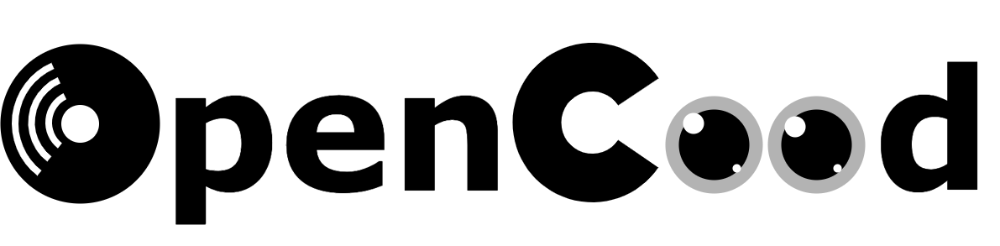
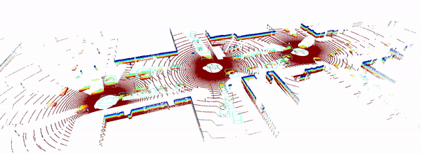
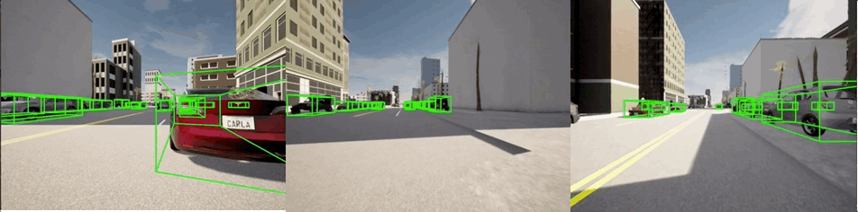

<<<<<<< HEAD
# Chapter-2-Code
=======
The code in this chapter is developed based on the OpenCOOD project.

  
  
&nbsp;

  
&nbsp;

 
 

OpenCOOD is an <strong>Open</strong> <strong>COO</strong>perative <strong>D</strong>etection framework for autonomous driving. It is also the official implementation of the <strong> ICRA 2022  </strong>
paper [OPV2V.](https://arxiv.org/abs/2109.07644)

